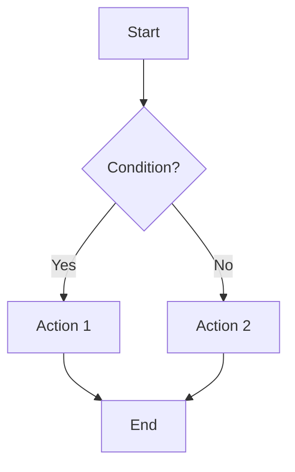

# GoLang variables

## 1. Introduction to `.md` Files
Markdown (`.md`) files are widely used for writing formatted text in a lightweight way.  
In every repository, you usually find a `README.md` file. This file provides:
- More information about the repository/project.
- Steps to run the service locally.
- Documentation for other developers.

### Learning Resources
- [Markdown Tutorial](https://www.markdowntutorial.com/)
- [Mermaid Diagrams Documentation](https://mermaid-js.github.io/mermaid/#/)

Mermaid helps generate **diagrams and flowcharts** inside `.md` files.

Example:


---

## 2. Variables in GoLang
A **variable** is a named storage that holds a value. Variables allow programs to store, update, and reuse data.

### Why do we need variables?
- To store information temporarily or permanently.
- To reuse and manipulate data in different parts of the program.
- To improve code readability and flexibility.

In Go, variables are **statically typed**, meaning the type of a variable is known at compile time.

### Declaring variables using `var`
```go
var name string
var password string = "12345"
var age int = 30

name = "John Doe"
name = "Jane@"

fmt.Println(name)
fmt.Println(password)
fmt.Println(age)
```

### Type inference using `:=`
Go can automatically infer the type of a variable based on the value assigned:
```go
secondName := "Smith"
fmt.Println(secondName)
fmt.Printf("Type: %T\n", secondName)

cost := 100.98
marks := 89
c := 'A'
fmt.Printf("Type: %T\n", cost)
fmt.Printf("Type: %T\n", marks)
fmt.Printf("Type: %T\n", c)
```

---

## 3. Multiple Variable Declaration
Go supports declaring multiple variables in a single line.

### Using `var`
```go
var x, y, z int = 1, 2, 3
fmt.Println(x, y, z)
```

### Using type inference (`:=`)
```go
a, b, _ := 4, 5, 6
fmt.Println(a, b)
```

Here `_` is the **blank identifier**, which ignores values we don’t want to use.

---

## 4. Global and Local Variables
- **Global variables**: Declared outside all functions and can be accessed by any function in the same package.
- **Local variables**: Declared inside a function and accessible only within that function.

Example:
```go
var global string = "Hello" // package-level variable

func main() {
    local := 100
    fmt.Println("local is", local)
}

func fun1() {
    // fmt.Println(local) // ❌ cannot access here
    fmt.Println(global)   // ✅ can access global variable
}
```

---

## 5. Blank Identifier `_`
The blank identifier is used to **ignore values** you don’t need. It is written as `_`.

Example:
```go
a, b, _ := 4, 5, 6
fmt.Println(a, b) // 6 is ignored
```

This is useful when a function returns multiple values and you only care about some of them.

---

## 6. Rune Type
A **rune** in Go is an alias for `int32` and represents a Unicode code point.
Go uses **rune** to clearly distinguish between a number and a character.

Example:
```go
r := 'B'
var char rune = 'C'
fmt.Printf("Type: %T\n", r)
fmt.Printf("Type: %T\n", char)
fmt.Println(r) // prints ASCII/Unicode value of 'B'
```

---

## 7. Statically Typed vs Dynamically Typed Languages

### Dynamically Typed
- Type of variable is determined **at runtime**.
- Example: Python, JavaScript.
```python
x = 10      # integer
x = "hello" # string now, no error
```

### Statically Typed
- Type of variable is determined **at compile time**.
- Once declared, the type cannot change.
- Example: Go, Java, C++.

```go
var num int = 10
// num = "hello" ❌ Compile-time error
```

### Why is Go Statically Typed?
- Ensures **type safety** at compile time.
- Prevents bugs caused by unexpected type changes.
- Improves performance because the compiler knows exact types beforehand.

---

## 8. Complete Example Code
```go
package main

import "fmt"

var global string = "Hello" // package level variable

func main() {
    local := 100
    // variable declaration
    var name string
    var password string = "12345"
    var age int = 30
    name = "John Doe"
    name = "Jane@"

    fmt.Println(name)
    fmt.Println(password)
    fmt.Println(age)

    secondName := "Smith"
    fmt.Println(secondName)
    fmt.Printf("Type: %T\n", secondName)

    cost := 100.98
    marks := 89
    c := 'A'
    fmt.Printf("Type: %T\n", cost)
    fmt.Printf("Type: %T\n", marks)
    fmt.Printf("Type: %T\n", c)

    // multiple variable declaration
    var x, y, z int = 1, 2, 3
    fmt.Println(x, y, z)

    // blank identifier
    a, b, _ := 4, 5, 6
    fmt.Println(a, b)

    r := 'B'
    var char rune = 'C'
    fmt.Printf("Type: %T\n", r)
    fmt.Printf("Type: %T\n", char)
    fmt.Println(r)

    var s string = "Hello, World!"
    fmt.Println(s)
    fmt.Println("local is", local)
}

func fun1() {
    // fmt.Println(local) // not accessible here
    fmt.Println(global)
}
```

---

## 9. Exercises

To practice the concepts, create a repository called **`go_exercises`**.  

Inside the repository:  
```
go_exercises/
 ├── README.md
 └── variables/
      ├── exercise1.go
      ├── exercise2.go
      ├── exercise3.go
      ├── exercise4.go
      └── exercise5.go
```

### Suggested Exercises

#### **Exercise 1: Basic Variable Declaration**
- Create variables of type `string`, `int`, and `float64` using `var`.
- Assign values and print them.
- Check their types using `%T`.

#### **Exercise 2: Type Inference**
- Declare variables using `:=`.
- Print values and types of at least three different data types (`int`, `float`, `string`).

#### **Exercise 3: Global vs Local Variables**
- Declare a **global variable** at package level.  
- Inside `main()`, declare a **local variable** with the same name.  
- Print both and observe the difference.  

#### **Exercise 4: Blank Identifier**
- Write a program where you assign three values to three variables, but ignore the third one using `_`.  
- Print only the first two.

#### **Exercise 5: Rune**
- Declare a variable of type `rune` and assign it a character.
- Print its type and value.
- Try printing another rune and compare.

---

## 10. README.md Example for `go_exercises`

```markdown
# Go Exercises Repository

This repository contains practice exercises for learning Go basics.

## Folder Structure
- `variables/` → Contains exercises related to variables, type inference, global/local scope, blank identifier, and runes.

## How to Run
1. Clone the repository:
   ```bash
   git clone https://github.com/your-username/go_exercises.git
   ```
2. Navigate into the folder:
   ```bash
   cd go_exercises/variables
   ```
3. Run each exercise:
   ```bash
   go run exercise1.go
   ```

